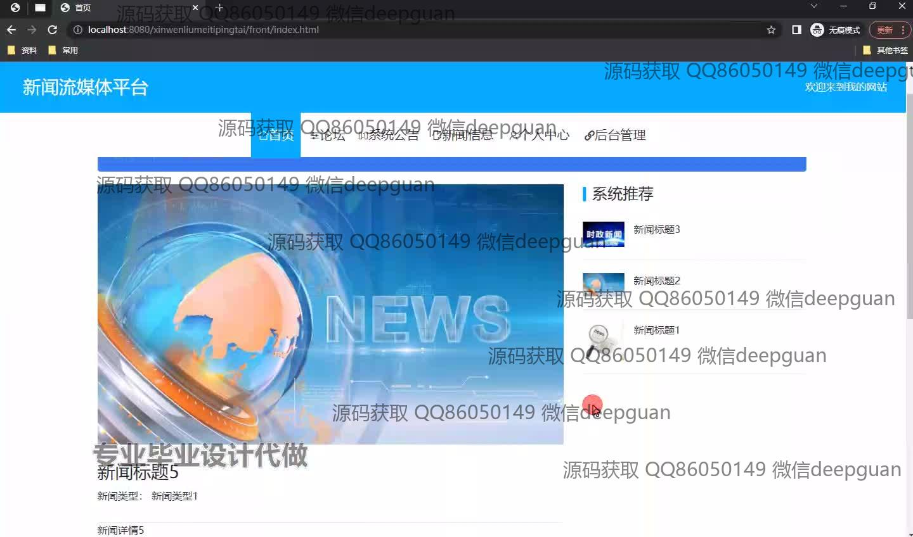
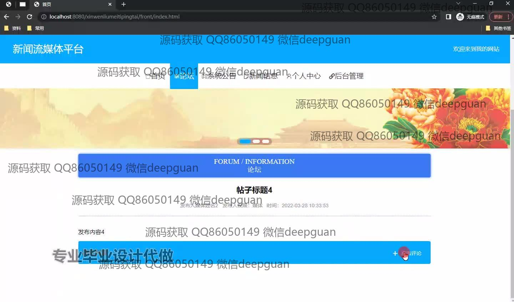
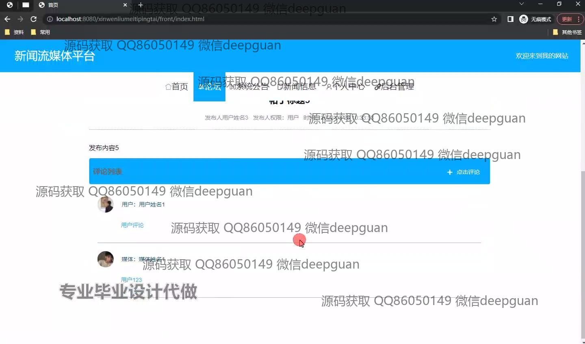
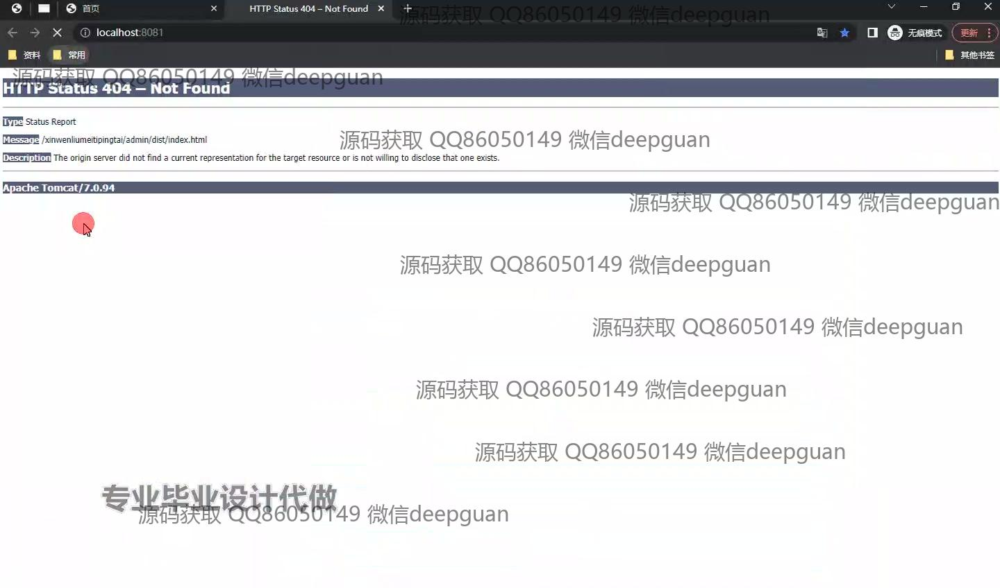
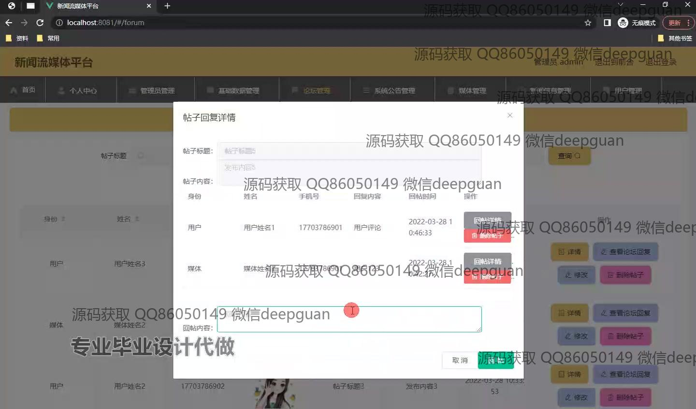
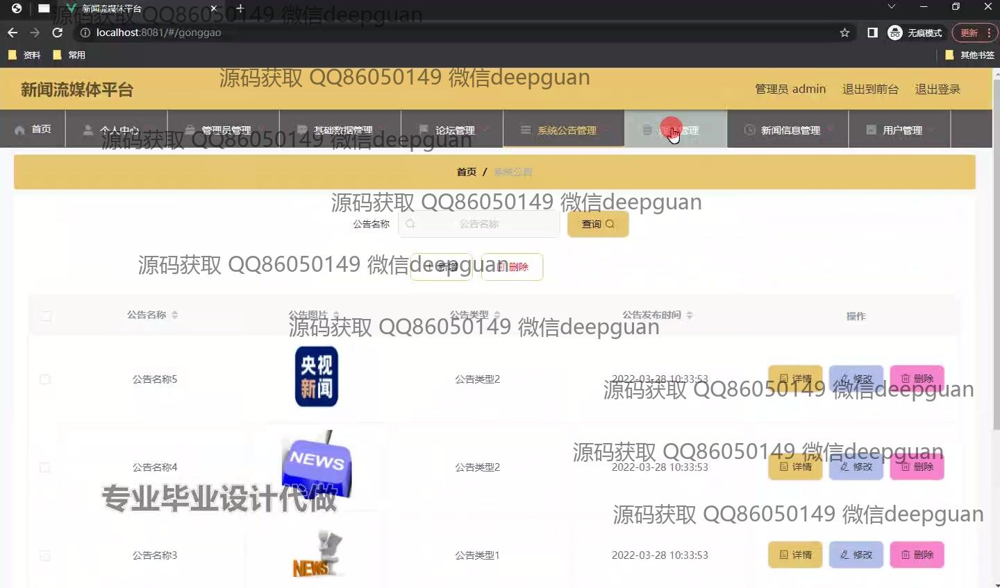
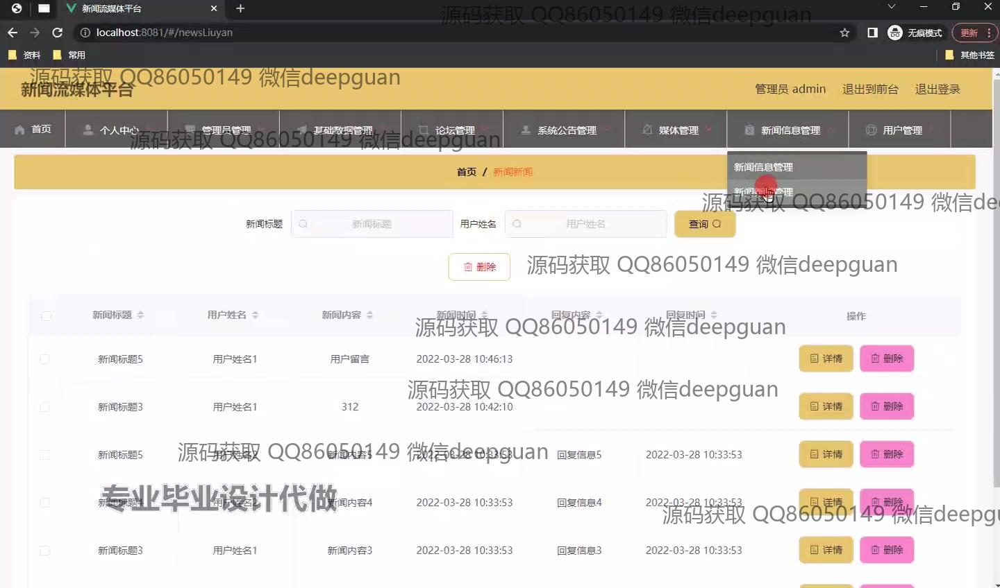
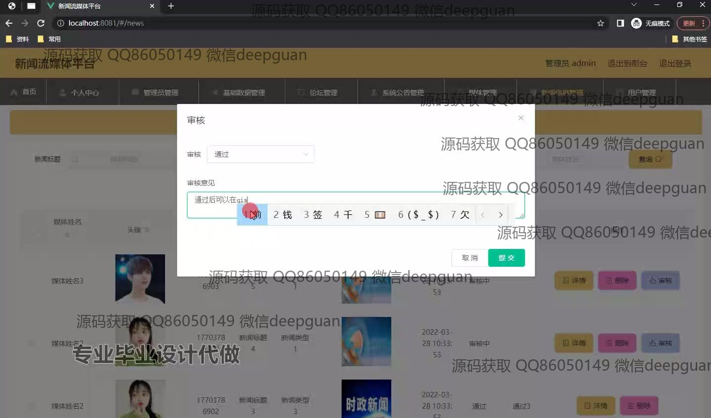
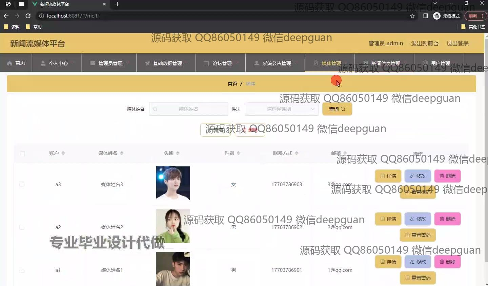
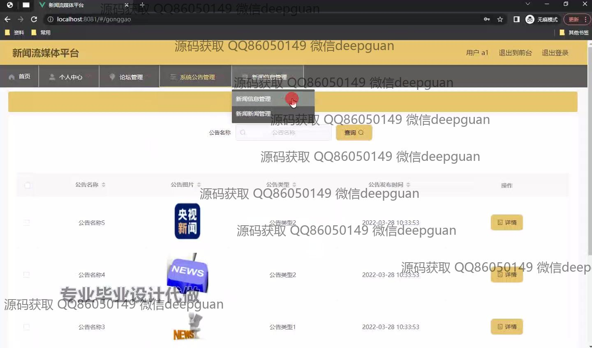

<h1 align="center">基于spring和vue开发的web新闻流媒体平台+vue</h1>

## 简介
新闻流媒体平台：角色分为管理员、用户；包含论坛管理、新闻信息管理、公告管理和用户交互功能，支持内容搜索和操作权限控制，界面简洁高效便于管理。    --计算机毕业设计源码；毕设源码；java毕业设计源码

## 联系方式

<h3 align="center">获取完整代码与数据库文件 + 微信：deepguan QQ: 86050149 QQ群: 783742310</h3>

<h3 align="center">可帮忙远程部署 包运行成功！提供远程部署、修改代码、设计文档指导、代码讲解等服务！</h3>

## 功能介绍（完整见运行截图）
管理员： 基本功能包括网站首页管理、个人信息查看与修改，以及管理员和公告管理功能。可进行新闻、公告、论坛的增删改查，管理用户信息，查看和回复帖子，以及进行媒体审核。
用户： 基本功能涵盖网站首页、论坛参与、新闻浏览和个人中心管理。在论坛中，用户可以发布帖子、查看评论、添加评论，并浏览系统公告和推荐新闻。个人中心允许用户查看和修改个人信息。

## 运行截图

本代码来源于网络,仅供学习参考使用!

